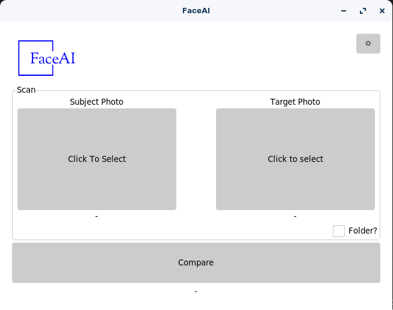
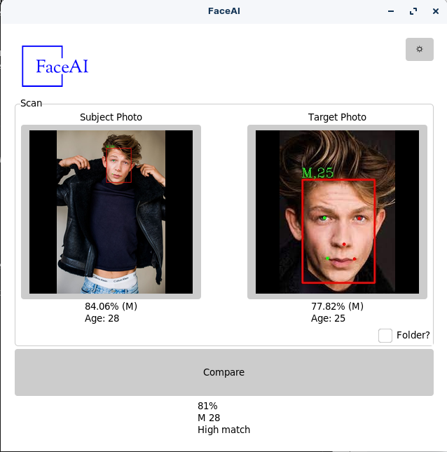
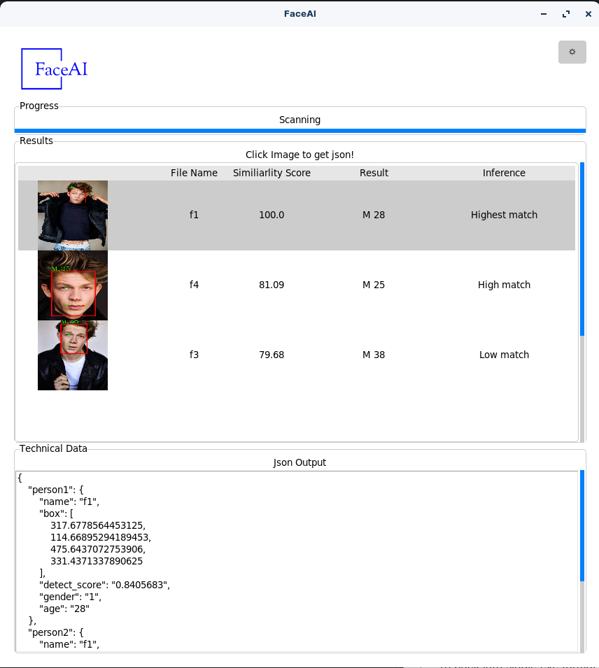
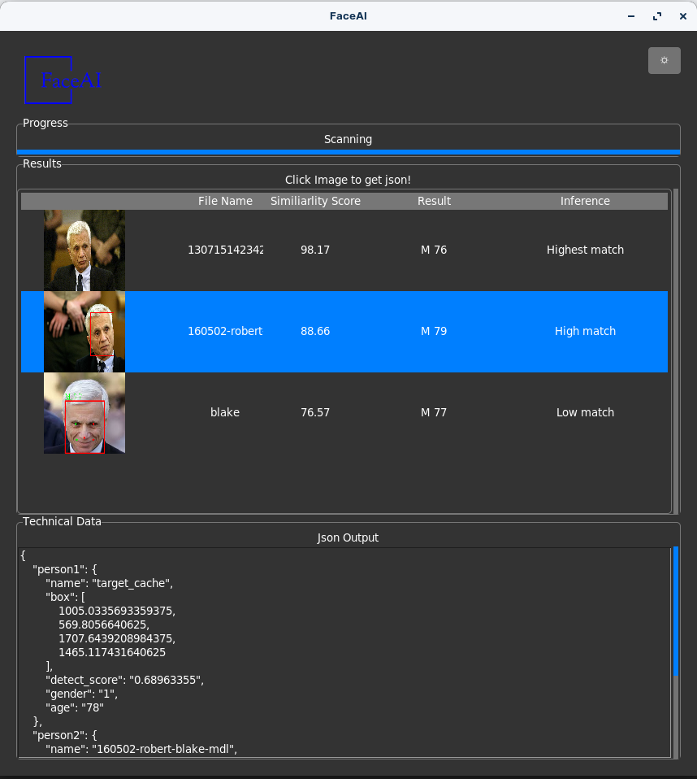

# FaceAI
FaceAI is image recognition, detection program with age & gender predictions! Based upon leading CVPR 2019 accepted Arcface algorithm (on insightface library)

## Progress
- Compare target photo with multiple photos from source.
- Compare target photo from set of photos in folder or a specific file!
- Progressbar/UI - Better
- Metrics - Technical Data
- Dark/Light Mode

## Demo
<br>





## Prerequisite
Just execute, all the models will be downloaded runtime!

## Installation
Clone this repository and run

```
python3 main.py
```
_Install any requirements/depedencies on the way_

To pack into single exe format (Please make sure python script is already running)
```
pyinstaller main.spec
```
